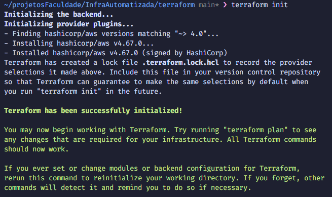
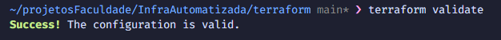
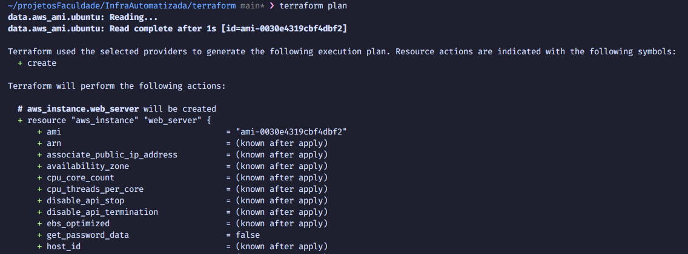
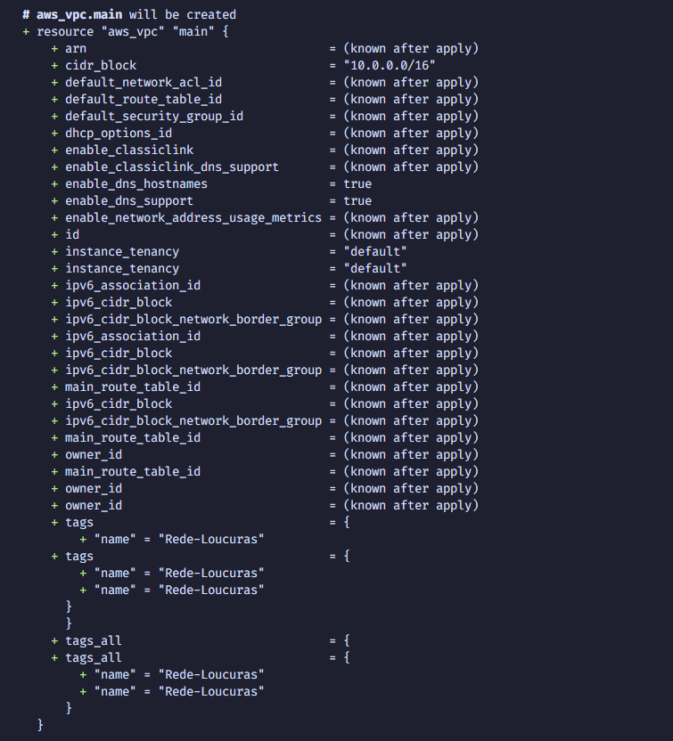
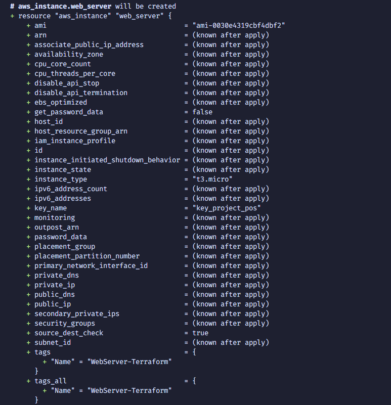
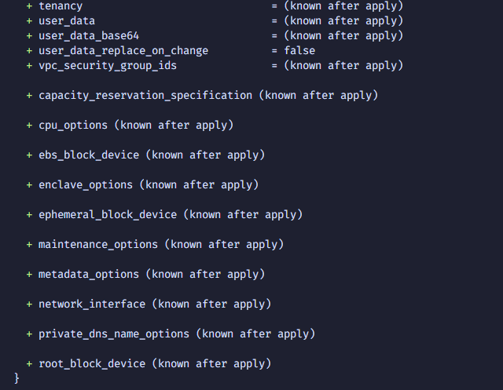
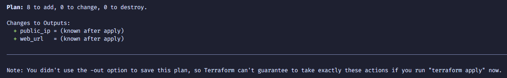
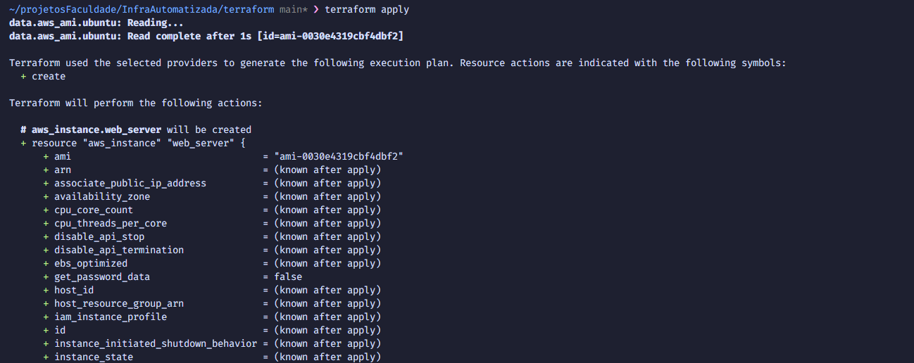
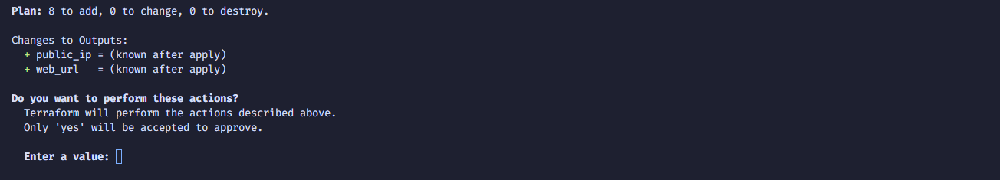
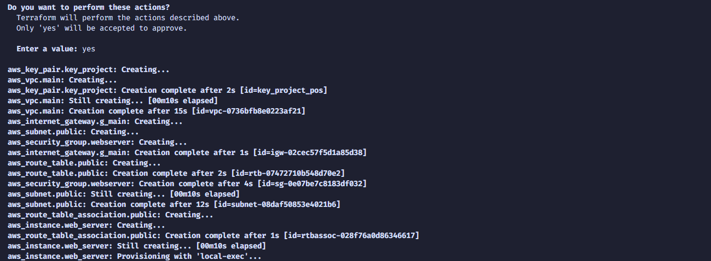

# 📸 Timeline de Execução - Infraestrutura Automatizada

Documento para compilar e organizar os prints do passo a passo de execução do projeto Terraform + Ansible.

---

## 🔍 Estrutura da Documentação

Esta timeline documenta cada etapa da execução, do `terraform init` até a aplicação rodando, com espaços dedicados para screenshots que comprovam o sucesso de cada passo.

---

# FASE 1: PREPARAÇÃO E INICIALIZAÇÃO TERRAFORM

## Step 1.1: Navegação e Inicialização

**Comando executado:**
```bash
cd terraform/
terraform init
```

**O que acontece:** Terraform baixa os providers (especialmente o provider AWS v4.0) e inicializa o diretório de trabalho.

**Resultado esperado:** Mensagem "Terraform has been successfully initialized!"

### 📸 Screenshot Step 1.1



---

## Step 1.2: Validação da Configuração Terraform

**Comando executado:**
```bash
terraform validate
```

**O que acontece:** Verifica se não há erros de sintaxe ou problemas nas configurações do Terraform.

**Resultado esperado:** Mensagem "Success! The configuration is valid."

### 📸 Screenshot Step 1.2



---

## Step 1.3: Visualizar Plano de Execução

**Comando executado:**
```bash
terraform plan
```

**O que acontece:** Mostra um preview de todos os recursos que serão criados, sem realmente criá-los.

**Resultado esperado:** 
- Listagem de 8 recursos a serem adicionados
- Nenhuma mudança em recursos existentes
- Nenhum recurso a ser destruído

### 📸 Screenshot Step 1.3a - Início do Plan



### 📸 Screenshot Step 1.3b - Recurso VPC



### 📸 Screenshot Step 1.3c - Recurso EC2




### 📸 Screenshot Step 1.3d - Resumo Final



---

# FASE 2: APLICAÇÃO DA INFRAESTRUTURA

## Step 2.1: Aplicar Configuração Terraform

**Comando executado:**
```bash
terraform apply
```

**Confirmação:**
```
Type 'yes' to confirm
```

**O que acontece:**
- AWS cria todos os 8 recursos (VPC, subnet, security group, EC2, etc.)
- Após a EC2 estar pronta, o provisioner Ansible é executado automaticamente
- Ansible atualiza pacotes e instala Nginx na instância

**Tempo estimado:** 3-5 minutos (a maioria do tempo é a EC2 iniciando)

### 📸 Screenshot Step 2.1a - Prompt de Confirmação






### 📸 Screenshot Step 2.1b - Criação de Recursos e EC2(Progresso)




### 📸 Screenshot Step 2.1c - Execução do Ansible
```
[ COLAR PRINT DO PROVISIONER ANSIBLE RODANDO ]
[ Mostrando: "Executar apt upgrade", "Instalar o Nginx", etc. ]
```

### 📸 Screenshot Step 2.1d - Conclusão do Apply
```
[ COLAR PRINT FINAL DO terraform apply ]
[ Deve mostrar os outputs com IP público e URL ]
```

---

## Step 2.2: Capturar Outputs

**Comando executado:**
```bash
terraform output
```

**O que isso mostra:**
- IP público da EC2 (`public_ip`)
- URL para acessar o servidor (`web_url`)

### 📸 Screenshot Step 2.2 - Outputs
```
[ COLAR PRINT DO terraform output ]
[ Deve mostrar:
  public_ip = "xxx.xxx.xxx.xxx"
  web_url = "http://xxx.xxx.xxx.xxx"
]
```

---

# FASE 3: VALIDAÇÃO DA INSTÂNCIA EC2

## Step 3.1: Conectar via SSH na EC2

**Comando executado:**
```bash
ssh -i ~/.ssh/id_ed25519 ubuntu@<IP_PUBLICO>
```

Substitua `<IP_PUBLICO>` pelo IP obtido no Step 2.2.

**Exemplo:**
```bash
ssh -i ~/.ssh/id_ed25519 ubuntu@54.123.456.789
```

**O que acontece:** Conecta remotamente na instância EC2 via SSH.

**Resultado esperado:** Você estará logado como usuário `ubuntu` na máquina remota.

### 📸 Screenshot Step 3.1 - Conexão SSH
```
[ COLAR PRINT DA CONEXÃO SSH ESTABELECIDA ]
[ Deve mostrar o prompt: ubuntu@ip-10-0-1-xxx:~$ ]
```

---

## Step 3.2: Verificar Atualização dos Pacotes

**Comando executado (dentro da EC2):**
```bash
sudo apt list --upgradable
```

**O que isso mostra:** Lista de pacotes que foram atualizados pelo Ansible.

### 📸 Screenshot Step 3.2 - Pacotes Atualizados
```
[ COLAR PRINT DO RESULTADO ]
[ Deve estar vazio ou mostrar muito poucos pacotes (sinal de que apt upgrade funcionou) ]
```

---

## Step 3.3: Verificar Status do Nginx

**Comando executado (dentro da EC2):**
```bash
sudo systemctl status nginx
```

**Resultado esperado:** Status "active (running)" - Nginx está rodando.

### 📸 Screenshot Step 3.3 - Status do Nginx
```
[ COLAR PRINT DO STATUS NGINX ]
[ Deve mostrar "active (running)" em verde ]
```

---

## Step 3.4: Verificar Página HTML Customizada

**Comando executado (dentro da EC2):**
```bash
cat /var/www/html/index.html
```

**O que mostra:** Conteúdo da página HTML criada pelo Ansible.

### 📸 Screenshot Step 3.4 - Conteúdo HTML
```
[ COLAR PRINT DO ARQUIVO ]
[ Deve mostrar: <h1>Deploy Automatizado com Terraform e Ansible</h1> ]
```

---

## Step 3.5: Sair da EC2

**Comando executado:**
```bash
exit
```

---

# FASE 4: VALIDAÇÃO DA APLICAÇÃO WEB

## Step 4.1: Acessar via Navegador (Método 1 - Navegador GUI)

**URL:** `http://<IP_PUBLICO>` (obtido no Step 2.2)

**Exemplo:** `http://54.123.456.789`

**O que acontece:** Abre a página web no navegador.

**Resultado esperado:** Página mostrando: "Deploy Automatizado com Terraform e Ansible"

### 📸 Screenshot Step 4.1 - Página no Navegador
```
[ COLAR PRINT DO NAVEGADOR ]
[ Mostrando a página com o título "Deploy Automatizado com Terraform e Ansible" ]
```

---

## Step 4.2: Acessar via Curl (Método 2 - Linha de Comando)

**Comando executado (na sua máquina local):**
```bash
curl http://<IP_PUBLICO>
```

**Exemplo:**
```bash
curl http://54.123.456.789
```

**O que mostra:** Resposta HTTP com o conteúdo HTML.

### 📸 Screenshot Step 4.2 - Curl
```
[ COLAR PRINT DO COMANDO curl ]
[ Deve mostrar o HTML da página e HTTP 200 ]
```

---

# FASE 5: LIMPEZA DE RECURSOS

## Step 5.1: Destruir Infraestrutura

**Comando executado (na pasta terraform/):**
```bash
terraform destroy
```

**Confirmação:**
```
Type 'yes' to confirm
```

**O que acontece:** Terraform remove TODOS os recursos criados (EC2, VPC, Security Group, etc.).

**Aviso:** ⚠️ Isso é permanente. Certifique-se de ter capturado todos os prints antes de executar.

### 📸 Screenshot Step 5.1a - Plano de Destruição
```
[ COLAR PRINT DO PLANO DE DESTRUIÇÃO ]
[ Deve mostrar "Terraform will perform the following actions:" ]
```

### 📸 Screenshot Step 5.1b - Destruição em Progresso
```
[ COLAR PRINT DURANTE A DESTRUIÇÃO ]
[ Mostrando recursos sendo removidos ]
```

### 📸 Screenshot Step 5.1c - Conclusão da Destruição
```
[ COLAR PRINT FINAL ]
[ Deve mostrar "Destroy complete! Resources: 8 destroyed." ]
```

---

# RESUMO VISUAL DA ARQUITETURA

```
┌─────────────────────────────────────────────────────────────┐
│                      AWS (us-east-1)                        │
├─────────────────────────────────────────────────────────────┤
│                                                              │
│  ┌─────────────────────────────────────────────────────┐   │
│  │  VPC: 10.0.0.0/16                                  │   │
│  │  ├─ Internet Gateway                               │   │
│  │  └─ Subnet Pública: 10.0.1.0/24                    │   │
│  │     ├─ Security Group (SSH:22, HTTP:80)            │   │
│  │     └─ EC2 Instance (t3.micro)                     │   │
│  │        ├─ Ubuntu 22.04 LTS                         │   │
│  │        ├─ Ansible: apt upgrade ✓                  │   │
│  │        ├─ Ansible: instala Nginx ✓                │   │
│  │        └─ Ansible: cria página HTML ✓             │   │
│  └─────────────────────────────────────────────────────┘   │
│                                                              │
└─────────────────────────────────────────────────────────────┘

          ↓ HTTP/HTTPS via porta 80
    
    [Navegador ou Curl]
    Acessa: http://IP_PUBLICO
    Retorna: "Deploy Automatizado com Terraform e Ansible"
```

---

# ✅ CHECKLIST DE SCREENSHOTS

Marque conforme coleta os prints:

- [ ] Step 1.1 - terraform init
- [ ] Step 1.2 - terraform validate
- [ ] Step 1.3a - terraform plan (início)
- [ ] Step 1.3b - terraform plan (VPC)
- [ ] Step 1.3c - terraform plan (EC2)
- [ ] Step 1.3d - terraform plan (resumo)
- [ ] Step 2.1a - terraform apply (prompt)
- [ ] Step 2.1b - terraform apply (progresso)
- [ ] Step 2.1c - terraform apply (EC2)
- [ ] Step 2.1d - terraform apply (Ansible)
- [ ] Step 2.1e - terraform apply (conclusão)
- [ ] Step 2.2 - terraform output
- [ ] Step 3.1 - SSH conectado
- [ ] Step 3.2 - apt list --upgradable
- [ ] Step 3.3 - systemctl status nginx
- [ ] Step 3.4 - cat /var/www/html/index.html
- [ ] Step 4.1 - Página no Navegador
- [ ] Step 4.2 - curl
- [ ] Step 5.1a - terraform destroy (plano)
- [ ] Step 5.1b - terraform destroy (progresso)
- [ ] Step 5.1c - terraform destroy (conclusão)

---

# 📝 NOTAS IMPORTANTES

1. **Ordem de Execução**: Siga a ordem dos steps para garantir que tudo funcione corretamente.

2. **Salvar IPs**: Anote o IP público gerado no Step 2.2, você precisará para os próximos steps.

3. **Permissões SSH**: Se tiver erro de permissão ao conectar via SSH, execute:
   ```bash
   chmod 400 ~/.ssh/id_ed25519
   ```

4. **Tempo de Espera**: A EC2 pode levar alguns minutos para estar completamente pronta. Se o SSH falhar na primeira tentativa, aguarde alguns segundos e tente novamente.

5. **Custos AWS**: Cada recurso criado pode gerar custos. Certifique-se de executar `terraform destroy` ao final para evitar cobranças desnecessárias.

6. **Segurança**: Os prints podem conter informações sensíveis (IPs, etc). Tenha cuidado ao compartilhá-los.

---

# 🎯 DICA FINAL

Para facilitar a documentação:
1. Abra um editor de imagens (Print Screen, Snip & Sketch, etc.)
2. Cole cada screenshot no local apropriado deste documento
3. Salve como PDF para apresentação final
4. Ou mantenha este markdown com links para as imagens em uma pasta `/screenshots/`