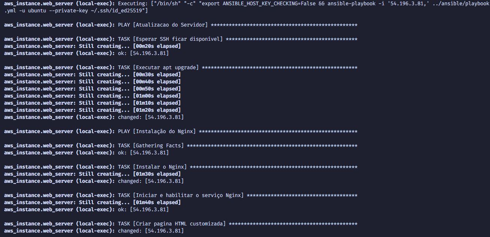
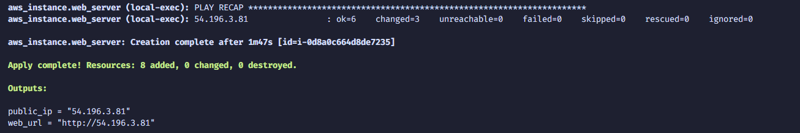
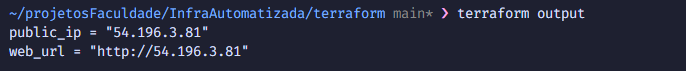
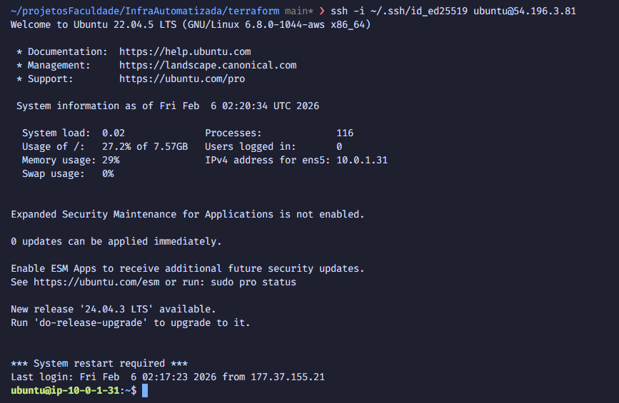
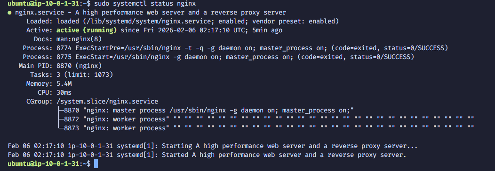
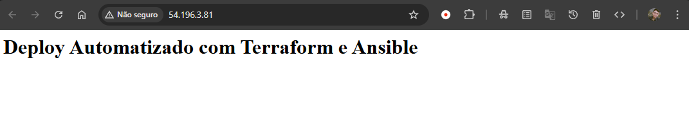
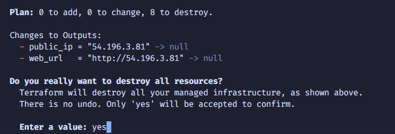
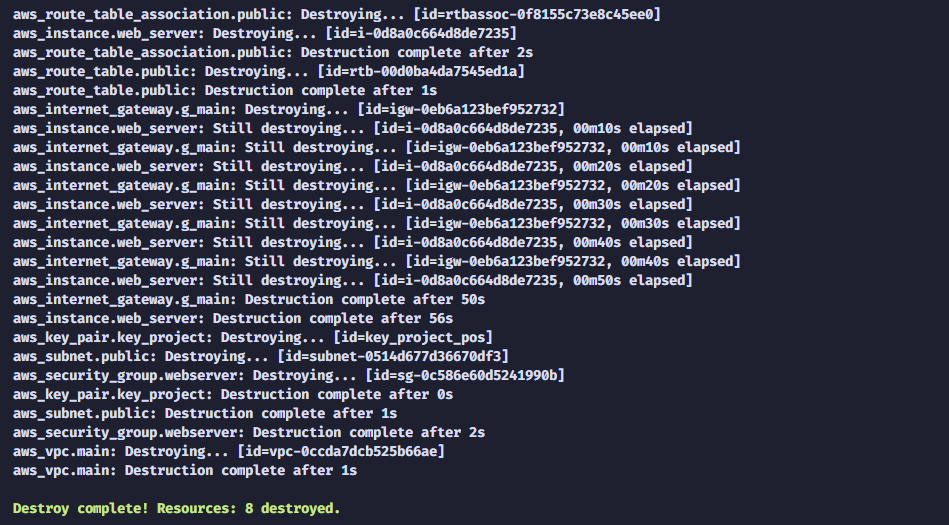

# 🏗️ Infraestrutura Automatizada com Terraform e Ansible

Guia completo e passo a passo para configurar o ambiente de desenvolvimento e fazer deploy automatizado de uma infraestrutura na AWS usando Terraform (IaC) e Ansible (automação de configuração).

## 📋 Pré-requisitos

- **Sistema operacional**: Ubuntu/Debian
- **Acesso sudo** no servidor local
- **Conexão com internet** estável
- **Conta AWS ativa** com acesso às chaves de segurança
- **Par de chaves SSH** (Ed25519 recomendado)

---

## 🚀 Guia Passo a Passo

### FASE 1: Preparação do Ambiente Local

#### Passo 1: Atualizar o Sistema

Primeiro, atualize os repositórios e pacotes do seu sistema:

```bash
sudo apt update
sudo apt upgrade -y
```

**O que faz**: Atualiza a lista de pacotes disponíveis e instala todas as atualizações de segurança e correções.

---

#### Passo 2: Gerar Chaves SSH (Se não tiver)

Se ainda não possui um par de chaves SSH, gere-o:

```bash
ssh-keygen -t ed25519 -f ~/.ssh/id_ed25519 -N ""
```

Verifique se foi criado:
```bash
ls -la ~/.ssh/
```

**O que faz**: Cria um par de chaves SSH (Ed25519) para autenticação segura sem senha entre sua máquina e as instâncias EC2.

---

#### Passo 3: Instalar Ansible

Instale o Ansible para automação de configuração:

```bash
sudo apt install ansible -y
```

Verifique a instalação:
```bash
ansible --version
```

**O que faz**: Instala o Ansible, que será usado para executar tasks de configuração automaticamente na instância EC2 após sua criação.

**Funcionalidade no projeto**:
- Atualiza o sistema operacional da EC2
- Instala e configura o Nginx
- Cria uma página HTML customizada

---

#### Passo 4: Instalar Terraform

Adicione o repositório HashiCorp:

```bash
wget -O - https://apt.releases.hashicorp.com/gpg | sudo gpg --dearmor -o /usr/share/keyrings/hashicorp-archive-keyring.gpg
```

```bash
echo "deb [arch=$(dpkg --print-architecture) signed-by=/usr/share/keyrings/hashicorp-archive-keyring.gpg] https://apt.releases.hashicorp.com $(grep -oP '(?<=UBUNTU_CODENAME=).*' /etc/os-release || lsb_release -cs) main" | sudo tee /etc/apt/sources.list.d/hashicorp.list
```

Atualize e instale:

```bash
sudo apt update
sudo apt install terraform -y
```

Verifique a instalação:
```bash
terraform --version
```

**O que faz**: Instala o Terraform, ferramenta de Infrastructure as Code (IaC) para criar e gerenciar infraestrutura na AWS de forma declarativa.

---

#### Passo 5: Instalar AWS CLI v2

Remova a versão antiga (se houver):

```bash
sudo apt remove awscli -y
```

Instale as dependências:

```bash
sudo apt install unzip -y
```

Baixe e instale o AWS CLI v2:

```bash
curl "https://awscli.amazonaws.com/awscli-exe-linux-x86_64.zip" -o "awscliv2.zip"
unzip awscliv2.zip
sudo ./aws/install
```

Limpe os arquivos temporários:

```bash
rm awscliv2.zip
rm -rf aws/
```

Verifique a instalação:
```bash
aws --version
```

**O que faz**: Instala a AWS CLI v2 para interagir com serviços AWS via linha de comando.

---

#### Passo 6: Configurar Credenciais AWS

Execute:

```bash
aws configure
```

Será solicitado:
- **AWS Access Key ID**: sua chave de acesso
- **AWS Secret Access Key**: sua chave secreta
- **Default region name**: `us-east-1` (ou sua região preferida)
- **Default output format**: `json`

**O que faz**: Salva suas credenciais AWS no arquivo `~/.aws/credentials` para que o Terraform possa autenticar na AWS.

---

### FASE 2: Estrutura e Funcionalidade do Terraform

O arquivo `terraform/main.tf` é responsável por criar toda a infraestrutura AWS. Abaixo está a explicação de cada componente:

#### 📦 Bloco de Configuração Terraform

```terraform
terraform {
  required_version = ">= 1.0.0"
  required_providers {
    aws = {
      source  = "hashicorp/aws"
      version = "~> 4.0"
    }
  }
}
```

**Funcionalidade**: Define a versão mínima do Terraform e especifica que o provider AWS versão 4.x será utilizado.

---

#### 🌐 Provider AWS

```terraform
provider "aws"{
    region = "us-east-1"
}
```

**Funcionalidade**: Configura a região AWS padrão como `us-east-1`. Todas as operações serão executadas nesta região.

---

#### 🖼️ Data Source: Ubuntu AMI

```terraform
data "aws_ami" "ubuntu" {
    most_recent = true
    owners = ["099720109477"]
    filter {
        name = "name"
        values = ["ubuntu/images/hvm-ssd/ubuntu-jammy-22.04-amd64-server-*"]
    }
}
```

**Funcionalidade**: 
- Busca a imagem AMI do Ubuntu mais recente
- Usa o filtro para encontrar Ubuntu Jammy 22.04 (LTS)
- Garante que sempre seja usada a versão mais atualizada da imagem

---

#### 🔗 Recurso 1: VPC (Virtual Private Cloud)

```terraform
resource "aws_vpc" "main" {
    cidr_block = "10.0.0.0/16"
    enable_dns_support = true
    enable_dns_hostnames = true
    tags = {
      name = "Rede-Loucuras"
    }
}
```

**Funcionalidade**:
- Cria uma rede privada virtual isolada
- CIDR `10.0.0.0/16` fornece 65.536 endereços IP
- Habilita suporte DNS para resolução de nomes

---

#### 🚪 Recurso 2: Internet Gateway

```terraform
resource "aws_internet_gateway" "g_main" {
  vpc_id = aws_vpc.main.id
  tags = {
    name = "gw-rede-loucuras"
  }
}
```

**Funcionalidade**:
- Conecta a VPC à internet
- Permite que instâncias EC2 na subnet pública acessem a internet
- Necessário para acesso HTTP/HTTPS externo

---

#### 🏢 Recurso 3: Subnet Pública

```terraform
resource "aws_subnet" "public" {
  vpc_id                  = aws_vpc.main.id
  cidr_block              = "10.0.1.0/24"
  map_public_ip_on_launch = true
  tags = {
    Name = "Subnet-Publica"
  }
}
```

**Funcionalidade**:
- Cria uma sub-rede dentro da VPC com range `10.0.1.0/24`
- `map_public_ip_on_launch = true` atribui IP público automaticamente a instâncias
- Permite acesso à internet via Internet Gateway

---

#### 🛣️ Recurso 4: Tabela de Rotas

```terraform
resource "aws_route_table" "public" {
  vpc_id = aws_vpc.main.id
  route {
    cidr_block = "0.0.0.0/0"
    gateway_id = aws_internet_gateway.g_main.id
  }
}
```

**Funcionalidade**:
- Define como o tráfego de rede é roteado
- Rota `0.0.0.0/0` (todo tráfego externo) via Internet Gateway
- Permite que hosts na subnet pública alcançem a internet

---

#### 📍 Recurso 5: Associação de Tabela de Rotas

```terraform
resource "aws_route_table_association" "public" {
  subnet_id      = aws_subnet.public.id
  route_table_id = aws_route_table.public.id
}
```

**Funcionalidade**: Associa a tabela de rotas à subnet pública para que as regras de roteamento sejam aplicadas.

---

#### 🔒 Recurso 6: Security Group (Firewall)

```terraform
resource "aws_security_group" "webserver" {
    name = "sg_web_nginx"
    description = "Permite acesso HTTP e SSH"
    vpc_id = aws_vpc.main.id

    ingress {
        from_port   = 22
        to_port     = 22
        protocol    = "tcp"
        cidr_blocks = ["0.0.0.0/0"]
    }

    ingress {
        from_port   = 80
        to_port     = 80
        protocol    = "tcp"
        cidr_blocks = ["0.0.0.0/0"]
    }

    egress {
        from_port   = 0
        to_port     = 0
        protocol    = "-1"
        cidr_blocks = ["0.0.0.0/0"]
    }
}
```

**Funcionalidade**:
- **Ingress SSH (porta 22)**: Permite acesso remoto via SSH
- **Ingress HTTP (porta 80)**: Permite acesso ao servidor web
- **Egress**: Permite toda saída de tráfego para qualquer destino

---

#### 🔑 Recurso 7: Par de Chaves AWS

```terraform
resource "aws_key_pair" "key_project" {
  key_name = "key_project_pos"
  public_key = file("~/.ssh/id_ed25519.pub")
}
```

**Funcionalidade**:
- Importa sua chave pública SSH para AWS
- Permite autenticação na EC2 sem usar senha
- A chave privada `~/.ssh/id_ed25519` será usada para conectar

---

#### 🖥️ Recurso 8: Instância EC2

```terraform
resource "aws_instance" "web_server" {
  ami           = data.aws_ami.ubuntu.id
  instance_type = "t3.micro"
  key_name = aws_key_pair.key_project.key_name
  subnet_id = aws_subnet.public.id
  vpc_security_group_ids = [aws_security_group.webserver.id]

  provisioner "local-exec" {
    command = "export ANSIBLE_HOST_KEY_CHECKING=False && ansible-playbook -i '${self.public_ip},' ../ansible/playbook.yml -u ubuntu --private-key ~/.ssh/id_ed25519"
  }

  tags = {
    Name = "WebServer-Terraform"
  }
}
```

**Funcionalidade**:
- **ami**: Usa a imagem Ubuntu mais recente encontrada
- **instance_type**: `t3.micro` (elegível para free tier)
- **Provisioner local-exec**: Executa Ansible automaticamente após a EC2 ser criada
  - Desabilita verificação de chave de host do SSH
  - Executa o playbook Ansible na máquina recém-criada
  - Usa autenticação por chave privada

---

#### 📤 Outputs (Saídas)

```terraform
output "public_ip" {
  description = "IP of the EC2 instance"
  value = aws_instance.web_server.public_ip
}

output "web_url" {
  description = "URL to access the web server"
  value = "http://${aws_instance.web_server.public_ip}"
}
```

**Funcionalidade**: Exibe automaticamente o IP público e URL de acesso ao servidor após o deploy.

---

### FASE 3: Funcionalidade do Ansible

O arquivo `ansible/playbook.yml` executa configurações automaticamente na instância EC2.

#### ⚙️ Play 1: Atualização do Sistema

```yaml
- name: Atualizacao do Servidor
  hosts: all
  become: yes
  gather_facts: no

  tasks:
    - name: Esperar SSH ficar disponível
      wait_for_connection:
        delay: 5
        timeout: 300

    - name: Executar apt upgrade
      apt:
        upgrade: yes
        update_cache: yes
      register: apt_result
      until: apt_result is success
      retries: 10
      delay: 10
```

**Funcionalidade**:
- Aguarda a disponibilidade da conexão SSH (até 300s)
- Atualiza todos os pacotes do sistema
- Tenta novamente até 10 vezes se houver falha

#### 📦 Play 2: Instalação do Nginx

```yaml
- name: Instalação do Nginx
  hosts: all
  become: yes
  tasks:
    - name: Instalar o Nginx
      apt:
        name: nginx
        state: present
        update_cache: yes

    - name: Iniciar e habilitar o serviço Nginx
      service:
        name: nginx
        state: started
        enabled: yes

    - name: Criar pagina HTML customizada
      copy:
        content: "<h1>Deploy Automatizado com Terraform e Ansible</h1>"
        dest: /var/www/html/index.html
```

**Funcionalidade**:
- Instala o servidor web Nginx
- Inicia o serviço e o habilita para iniciar no boot
- Cria uma página HTML customizada

---

## 🎯 Passo a Passo para Deploy

### Step 1.1: Navegação e Inicialização

**Comando executado:**
```bash
cd terraform/
terraform init
```

**O que acontece:** Terraform baixa os providers (especialmente o provider AWS v4.0) e inicializa o diretório de trabalho.

**Resultado esperado:** Mensagem "Terraform has been successfully initialized!"

#### 📸 Screenshot Step 1.1


---

### Step 1.2: Validação da Configuração Terraform

**Comando executado:**
```bash
terraform validate
```

**O que acontece:** Verifica se não há erros de sintaxe ou problemas nas configurações do Terraform.

**Resultado esperado:** Mensagem "Success! The configuration is valid."

#### 📸 Screenshot Step 1.2


---

### Step 1.3: Visualizar Plano de Execução

**Comando executado:**
```bash
terraform plan
```

**O que acontece:** Mostra um preview de todos os recursos que serão criados, sem realmente criá-los.

**Resultado esperado:** 
- Listagem de 8 recursos a serem adicionados
- Nenhuma mudança em recursos existentes
- Nenhum recurso a ser destruído

#### 📸 Screenshot Step 1.3a - Início do Plan


#### 📸 Screenshot Step 1.3b - Recurso VPC


#### 📸 Screenshot Step 1.3c - Recurso EC2


#### 📸 Screenshot Step 1.3d - Resumo Final


---

### Step 2.1: Aplicar Configuração Terraform

**Comando executado:**
```bash
terraform apply
```

**Confirmação:**
```
Type 'yes' to confirm
```

**O que acontece:**
- AWS cria todos os 8 recursos (VPC, subnet, security group, EC2, etc.)
- Após a EC2 estar pronta, o provisioner Ansible é executado automaticamente
- Ansible atualiza pacotes e instala Nginx na instância

**Tempo estimado:** 3-5 minutos (a maioria do tempo é a EC2 iniciando)

#### 📸 Screenshot Step 2.1a - Prompt de Confirmação


#### 📸 Screenshot Step 2.1b - Criação de Recursos e EC2(Progresso)


#### 📸 Screenshot Step 2.1c - Execução do Ansible



#### 📸 Screenshot Step 2.1d - Conclusão do Apply



---

### Step 2.2: Capturar Outputs

**Comando executado:**
```bash
terraform output
```

**O que isso mostra:**
- IP público da EC2 (`public_ip`)
- URL para acessar o servidor (`web_url`)

#### 📸 Screenshot Step 2.2 - Outputs



---

### Step 3.1: Conectar via SSH na EC2

**Comando executado:**
```bash
ssh -i ~/.ssh/id_ed25519 ubuntu@<IP_PUBLICO>
```

Substitua `<IP_PUBLICO>` pelo IP obtido no Step 2.2.

**Exemplo:**
```bash
ssh -i ~/.ssh/id_ed25519 ubuntu@54.123.456.789
```

**O que acontece:** Conecta remotamente na instância EC2 via SSH.

**Resultado esperado:** Você estará logado como usuário `ubuntu` na máquina remota.

#### 📸 Screenshot Step 3.1 - Conexão SSH



---

### Step 3.2: Verificar Status do Nginx

**Comando executado (dentro da EC2):**
```bash
sudo systemctl status nginx
```

**Resultado esperado:** Status "active (running)" - Nginx está rodando.

#### 📸 Screenshot Step 3.2 - Status do Nginx



---

### Step 3.3: Sair da EC2

**Comando executado:**
```bash
exit
```

---

### Step 4.1: Acessar via Navegador (Método 1 - Navegador GUI)

**URL:** `http://<IP_PUBLICO>` (obtido no Step 2.2)

**Exemplo:** `http://54.123.456.789`

**O que acontece:** Abre a página web no navegador.

**Resultado esperado:** Página mostrando: "Deploy Automatizado com Terraform e Ansible"

#### 📸 Screenshot Step 4.1 - Página no Navegador



---

### Step 5.1: Destruir Infraestrutura

**Comando executado (na pasta terraform/):**
```bash
terraform destroy
```

**Confirmação:**
```
Type 'yes' to confirm
```

**O que acontece:** Terraform remove TODOS os recursos criados (EC2, VPC, Security Group, etc.).

#### 📸 Screenshot Step 5.1a - Plano de Destroy



#### 📸 Screenshot Step 5.1b - Progresso e conclusão do Destroy



---

## 📋 Resumo da Arquitetura

```
┌─────────────────────────────────────────────────────────────┐
│                      AWS (us-east-1)                        │
├─────────────────────────────────────────────────────────────┤
│                                                              │
│  ┌─────────────────────────────────────────────────────┐   │
│  │  VPC: 10.0.0.0/16                                  │   │
│  │  ├─ Internet Gateway                               │   │
│  │  └─ Subnet Pública: 10.0.1.0/24                    │   │
│  │     ├─ Security Group (SSH:22, HTTP:80)            │   │
│  │     └─ EC2 Instance (t3.micro)                     │   │
│  │        ├─ Ubuntu 22.04 LTS                         │   │
│  │        ├─ Ansible: apt upgrade ✓                  │   │
│  │        ├─ Ansible: instala Nginx ✓                │   │
│  │        └─ Ansible: cria página HTML ✓             │   │
│  └─────────────────────────────────────────────────────┘   │
│                                                              │
└─────────────────────────────────────────────────────────────┘

          ↓ HTTP/HTTPS via porta 80
    
    [Navegador ou Curl]
    Acessa: http://IP_PUBLICO
    Retorna: "Deploy Automatizado com Terraform e Ansible"
```

---

## 📝 NOTAS IMPORTANTES

1. **Ordem de Execução**: Siga a ordem dos steps para garantir que tudo funcione corretamente.

2. **Salvar IPs**: Anote o IP público gerado no Step 2.2, você precisará para os próximos steps.

3. **Tempo de Espera**: A EC2 pode levar alguns minutos para estar completamente pronta. Se o SSH falhar na primeira tentativa, aguarde alguns segundos e tente novamente.

4. **Custos AWS**: Cada recurso criado pode gerar custos. Certifique-se de executar `terraform destroy` ao final para evitar cobranças desnecessárias.

---

## 🆘 Solução de Problemas

### Erro: "Permission denied" ao conectar via SSH
```bash
chmod 400 ~/.ssh/id_ed25519
```

### Erro: "aws_key_pair" public_key not found
Certifique-se que a chave SSH foi gerada:
```bash
ls -la ~/.ssh/id_ed25519.pub
```

### Ansible não consegue conectar
Verifique se o Security Group permite SSH (porta 22):
```bash
aws ec2 describe-security-groups --group-ids <sg-id>
```

### Terraform não encontra credenciais AWS
Verifique se `aws configure` foi executado:
```bash
cat ~/.aws/credentials
```

---

**Última atualização**: 06/02/2026